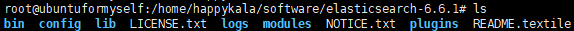

### 单实例安装和启动

#### 安装java开发环境
1、下载jdk8  
下载地址：https://www.oracle.com/technetwork/java/javase/downloads/jdk8-downloads-2133151.html

2、解压之后移动到opt目录下
```
tar -zxf jdk-8u201-linux-x64.tar.gz
sudo mv jdk1.8.0_201 /opt/
```

3、修改环境变量  
```
vim ~/.bashrc
```
在最后面加上如下的代码(具体的路径地址根据实际情况做调整)：
```
export JAVA_HOME=/opt/jdk1.8.0_201
export JRE_HOME=${JAVA_HOME}/jre
export CLASSPATH=.${JAVA_HOME}/lib:${JRE_HOME}/lib
export PATH=${JAVA_HOME}/bin:$PATH
```
刷新立即生效
```
source ~/.bashrc
```

4、版本效果  


### 安装elasticsearch

1、下载源码包
下载地址（或者自己去百度搜索并官网下载）：https://www.elastic.co/downloads/elasticsearch

  

2、解压安装  
下载linux版本，将下载的文件上传到linux中，解压并放置到自己常用的软件安装目录中，解压后的文件目录如下：  
  

3、启动es  
进入bin目录，使用`elasticsearch`命令来启动：  
es不建议使用root用户启动，会出现下面的错误:  
  

切换到非root用户之后该用户没有es的安装目录操作权限的时候会出现下面的错误：  
  

``
chown -R 用户名:用户名 文件目录
``  
使用上面的命令来给与当前用户权限，启动的时候会输出一些日志信息，注意看下面的日志输出，表示启动成功  
  

启动的时候还有可能出现下面的问题而启动不了：  
  

进入到root用户设置一下,后面这个262144请根据日志提示来设置    
```
sysctl -w vm.max_map_count=262144
```
检查值是否设置好了  
```
sysctl -a | grep "vm.max_map_count"
```


4、浏览器访问es  
http://ip:9200，其中ip表示es安装服务器的ip地址，现在直接访问应该是访问失败的，需要修改配置文件中的外网访问ip限制，在config目录下有elasticsearch.yml文件其中的`network.host`属性放开并设置ip限制为`0.0.0.0`,修改图如下：  
   
启动之后再控制台使用curl命令访问localhost:9200  
  
浏览器访问：  


5、常用命令（逐步补充,命令是相对目录而言的，使用的使用请注意实际调整）  
 |命令|说明|
 |:--|:--|
 |./elasticsearch|启动命令|
 |nohup./elasticsearch&|后台启动命令|


解决elasticsearc不能浏览器访问参考：
https://www.jianshu.com/p/658961f707d8
https://my.oschina.net/codingcloud/blog/1615013


elasticsearch的head插件安装：
有两种处理方法：  
1、谷歌应用市场已经处理好的插件包文件，这个后面下载处理  
2、去github上下载源码安装访问：源码地址https://github.com/mobz/elasticsearch-head  
    首先安装一下git apt-get install git
    然后安装npm apt-get install node-legacy安装的是4.2.6版本太低，可以参考下面的安装：
    https://www.cnblogs.com/you-jia/p/9620172.html
    或者
    https://jingyan.baidu.com/article/f25ef254bbbcb7482c1b82b9.html

    将elasticsearch-head的源码git下来，然后使用npm install安装包文件,然后启动npm start

    启动之后访问ip:9100，修改elasticsearch的IP地址杰克访问

要能够访问还需要修改elasticsearch的配置文件设置跨域的访问限制放开

    vim /XXX/config/elasticsearch.yml,其中XXX为elasticsearch的安装目录

    再最后面添加
    ```
    http.cors.enabled: true
    http.cors.allow-origin: "*"
    ```    

### 分布式安装和启动

master节点配置文件新增配置：  
cluster.name: happykala //集群名称  
node.name: master //设置当前节点名字为master  
node.master: true //设置当前节点是master节点

network.host: 127.0.0.1 //制定ip 端口使用默认的9200

源码安装过程和主节点是一致的，起一个文件夹名字不一样即可
slaver节点配置文件新增配置：  
cluster.name: happykala  
node.name: slaver1

network.host: 0.0.0.0  
http.port: 8200

discovery.zen.ping.unicast.hosts: ["0.0.0.0"]


### 基础概念
索引  类型  文档

### 索引创建
api的基础格式:
http://ip:port/<索引>/<类型>/<文档id>

常用的http动作：
GET/PUT/POST/DELETE