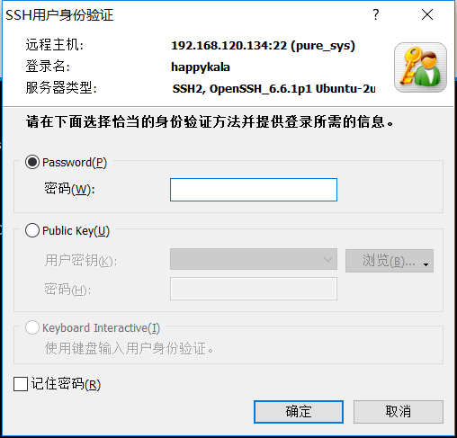

## 使用Xshell连接服务器主机（ubuntu14.04为例）

### 1、安装并启动openssh服务
在使用xshell连接ubuntu之前需要服务器组件安装开启了ssh服务  
使用`ps -e | grep ssh`查看是都开启了ssh服务，没有安装和开启的截图如下：

使用命令行`sudo apt-get install openssh-server`去安装这个服务  

再次使用`ps -e | grep ssh`查看服务的情况

有sshd的情况表示服务已经启动了，没有的情况下使用`/etc/init.d/ssh start`启动即可

### 2、查看主机ip
服务器ip查看的命令行`ifconfig`

### 3、使用Xshell配置并连接

#### 3.1、新建连接信息

#### 3.2、具体的链接信息填写

#### 3.2、开始连接

#### 3.3、密码保存方式选择

#### 3.4、输入用户名和密码

#### 3.5、连接成功

