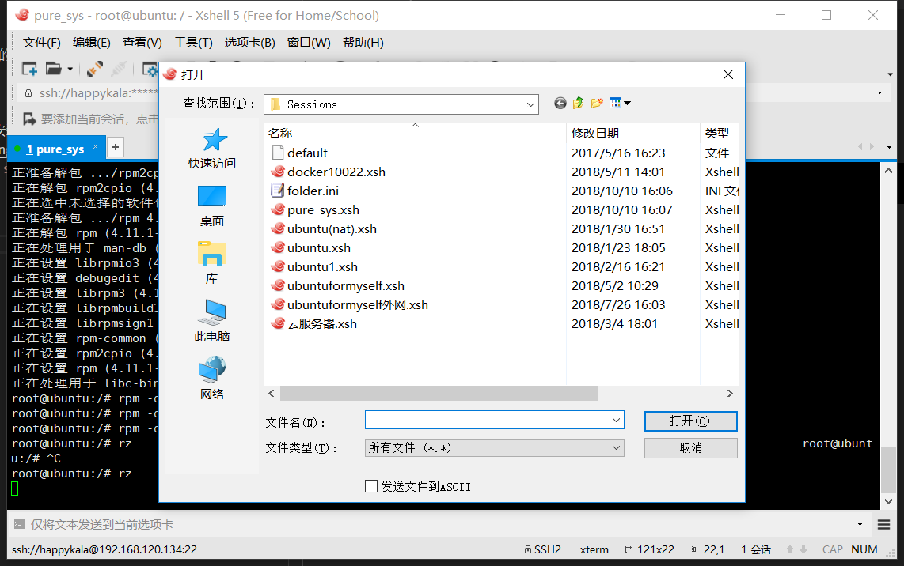
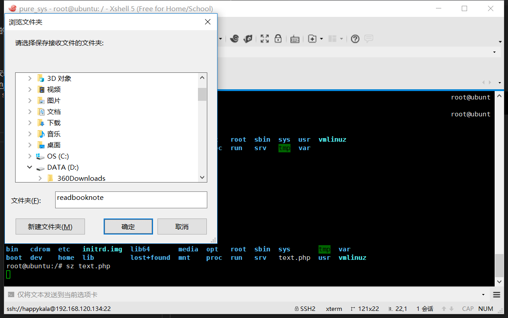

## 使用Xshell上传文件

lrzsz是一款在linux中代替ftp进行文件上传的程序

### 1、查看lrzsz的安装情况并安装

命令行`ps -e | grep lrzsz`查看lrzsz的安装情况  

上述没有安装的情况下安装即可，安装命令是`sudo apt-get install lrzsz`

### 2、上传文件和发送文件
安装lrzsz之后使用`rz`命令来接收上传文件，使用`sz`将服务器文件下载到本地
接收：

发送：
  
