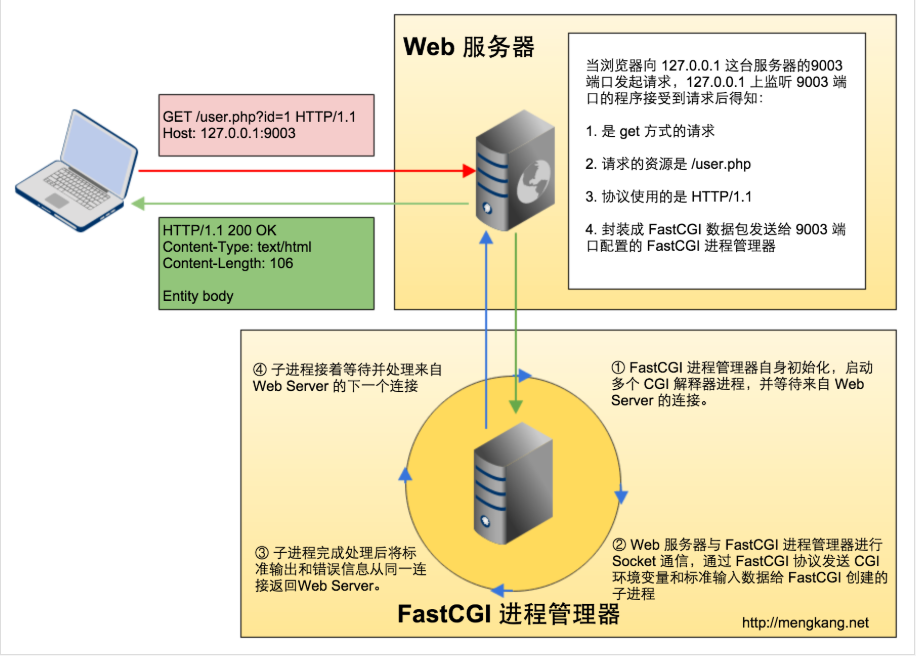

**克隆指定的代码库**
-

git clone https://github.com/happykala/php_core_explain.git

在github上克隆下PHP的官方版本

git clone https://github.com/php/php-src.git


切换到PHP7.0的版本


单线程的SAPI的执行过程:


**php的运行模式**
-
php的运行模式主要有CGI,fastCGI和apache模块这几种方式，目前见到的是
fastcgi和apache模块的方式运行

apache模块方式的解释说明见[链接](http://www.php-internals.com/book/?p=chapt02/02-02-01-apache-php-module)

fastcgi是cgi模式的升级版本，说明解释见[链接](http://www.php-internals.com/book/?p=chapt02/02-02-03-fastcgi)

cgi模式下的运行原理示意图：


1、客户端访问 http://127.0.0.1:9003/cgi-bin/user?id=1  
2、127.0.0.1 上监听 9003 端口的守护进程接受到该请求    
3、通过解析 HTTP 头信息，得知是 GET 请求，并且请求的是 /cgi-bin/ 目录下的 user 文件。  
4、将 uri 里的 id=1 通过存入 QUERY_STRING 环境变量。  
5、Web 守护进程 fork 一个子进程，然后在子进程中执行 user 程序，通过环境变量获取到id。  
6、执行完毕之后，将结果通过标准输出返回到子进程。  
7、子进程将结果返回给客户端


fastcgi的运行原理示意图：


1、FastCGI 进程管理器自身初始化，启动多个 CGI 解释器进程，并等待来自 Web Server 的连接。   
2、Web 服务器与 FastCGI 进程管理器进行 Socket 通信，通过 FastCGI 协议发送 CGI 环境变量和标准输入数据给 CGI 解释器进程。  
3、CGI 解释器进程完成处理后将标准输出和错误信息从同一连接返回 Web Server。  
4、CGI 解释器进程接着等待并处理来自 Web Server 的下一个连接。

**php程序的执行**
-
程序的执行遵循以下的两步：  
1、传递给php程序需要执行的文件， php程序完成基本的准备工作后启动PHP及Zend引擎， 加载注册的扩展模块  
2、初始化完成读取脚本文件之后，Zend引擎对脚本进行词法分析、语法分析。然后编译为opcode。在安装了apc之类的opcode缓存，编译缓解可能被跳过直接从缓存中读取opcode执行。

词法分析的示例-[词法、语法分析示例代码](./examplecode/example1.php)


**php的变量和数据类型**
-
变量的三个基本组成部分:  
- 名称
- 类型
- 值

从类型的角度来划分变成语言主要分为以下的几类：  
- 静态语言类型，比如C/java
- 动态语言类型 php/python
- 无类型语言 汇编语言

php中绝大部分的语言类型的实现使用了哈希表处理，在其中解决哈希表冲突使用的是链表  

**常量的定义和实现**
-
在php中定义常量可以使用define函数和const修饰符，define是函数，const语言结构  
在[解析代号表](http://php.net/manual/zh/tokens.php)中可以找到const的解析代号,解析代号如下：  


首先说明一下二者的区别：
- const是一种语言结构，define是函数，后者可以通过第三个参数来确定是否对大小写敏感，true表示大小写不敏感，默认false
``` php 
define('PI',3.141592654, true)
```
- const简单易读，编译的时候比define快
- const可以在类中使用，用于定义类的成员变量，定义之后不可以修改，define不可在类中使用，可以定义全局变量

``` php 
class Myclass{
    const pi = 3.141592654;
    //常量显示输出函数
    function showConstant(){
        echo self::pi;
        echo constant('pi');
    }

}
```

- const在编译的时候定义，需要在最顶端的作用域，不能再函数、循环、if判断中使用，define是函数，能够调用函数的地方都可以使用
``` php 
$boolFlag = true;
if($boolFlag){
    const test = 'hello world'; //定非法
}

if($boolFlag){
    define('test', 'hello world');//定义合法
}
```

- const只能够使用普通变量名，define可以使用表达式
- const只能定义静态常量，define可以是任意表达式

接下来说明define的函数实现过程  
常量的内部实现结构如下  
``` c 
typedef struct _zend_constant {
	zval value;//类似于变量的zval结构
	zend_string *name;//常量的名字
	int flags;//大小写敏感的标记
	int module_number;//木块编号
} zend_constant;
```

具体的函数实现路径在<font color='red'>Zend/zend_builtin_functions.c文件</font>中，函数名是<font color='red'>ZEND_FUNCTION(define)</font>  
``` c 
    ZVAL_DUP(&c.value, val); //赋值
	zval_ptr_dtor(&val_free);
register_constant:
	c.flags = case_sensitive; /* non persistent */
	c.name = zend_string_copy(name); /* 常量名称 */
	c.module_number = PHP_USER_CONSTANT; /* 模块标号 */
	if (zend_register_constant(&c) == SUCCESS) {
		RETURN_TRUE;
	} else {
		RETURN_FALSE;
	}
```
上述代码是对常量接口定义中属性的赋值过程，赋值完毕之后将对应的结构体注册到常量列表中，下面的代码是大小写敏感的处理
``` c 
    zend_string *name; //常量名称
	zval *val, val_free; //值
	zend_bool non_cs = 0; //记录大小的临时变量
	int case_sensitive = CONST_CS; // 大小写是否敏感，默认为1
	zend_constant c;

	//省略了部分代码

	if (non_cs) {
		case_sensitive = 0;
	}
```
除了CONST_CS标记，常量的flags字段通常还可以用CONST_PERSISTENT和CONST_CT_SUBST  CONST_PERSISTENT标识当前的常量需要持久化  
CONST_CT_SUBST标识编译的时候可以被替换在PHP内核中这些常量包括：TRUE、FALSE、NULL、ZEND_THREAD_SAFE和ZEND_DEBUG_BUILD五个

通过define()函数定义的常量的模块编号都是PHP_USER_CONSTANT，这表示是用户定义的常量。 除此之外我们在平时使用较多的常量：如错误报告级别E_ALL, E_WARNING等常量就有点不同了。 这些是PHP内置定义的常量，他们属于标准常量。  


魔术常量
|标题|标题
|:---|:---
\_\_LINE__ | 文件中的当前行号
\_\_FILE__ | 文件的完整路径和文件名。如果用在被包含文件中，则返回被包含的文件名。自 PHP 4.0.2 起，FILE 总是包含一个绝对路径（如果是符号连接，则是解析后的绝对路径），而在此之前的版本有时会包含一个相对路径。
\_\_DIR__ |文件所在的目录。如果用在被包括文件中，则返回被包括的文件所在的目录。它等价于 dirname(FILE)。除非是根目录，否则 目录中名不包括末尾的斜杠。（PHP 5.3.0中新增）
\_\_FUNCTION__ | 函数名称（PHP 4.3.0 新加）。自 PHP 5 起本常量返回该函数被定义时的名字（区分大小写）。在 PHP 4 中该值总是小写 字母的
\_\_CLASS__ | 类的名称（PHP 4.3.0 新加）。自 PHP 5 起本常量返回该类被定义时的名字（区分大小写）。在 PHP 4 中该值总是小写字母的
\_\_METHOD__ | 类的方法名（PHP 5.0.0 新加）。返回该方法被定义时的名字（区分大小写）。
\_\_NAMESPACE__ | 当前命名空间的名称（大小写敏感）。这个常量是在编译时定义的（PHP 5.3.0 新增）


 


 

