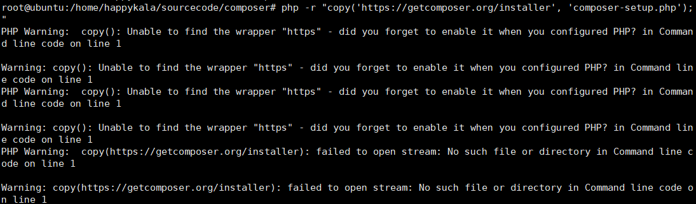
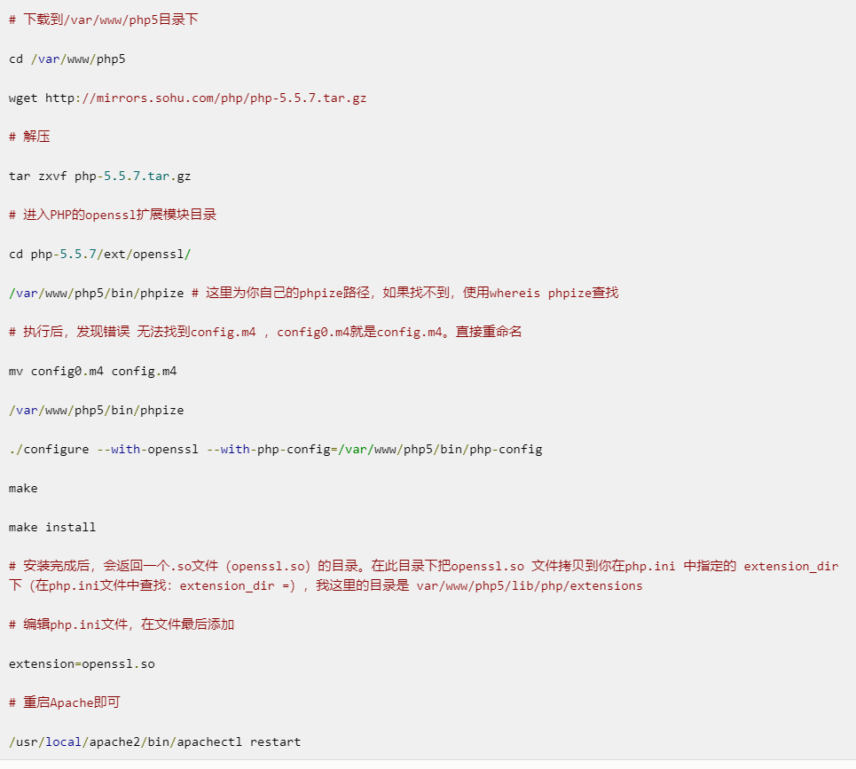

## composer包管理工具安装
### 1、安装过程参考
安装的过程可以[参考](https://getcomposer.org/download/)  
### 2、获取安装文件
php -r "copy('https://getcomposer.org/installer', 'composer-setup.php');"  

>上面的命令行出现如下错误：  
  
解决的办法是开启php的openssl扩展，可以参考[这里](https://www.haorooms.com/post/php_openssl)  
这里引申出一个比较普遍的问题，如何在已经编译完成的php中安装额外的扩展，在当前php安装源码没有删除的时候进入到安装源码的ext文件夹中找到对应的扩展包，安装即可，参考代码截图如下：  

命令下载了一个安装的php文件composer-setup.php

### 3、使用hash算法检测文件
php -r "if (hash_file('SHA384', 'composer-setup.php') === '93b54496392c062774670ac18b134c3b3a95e5a5e5c8f1a9f115f203b75bf9a129d5daa8ba6a13e2cc8a1da0806388a8') { echo 'Installer verified'; } else { echo 'Installer corrupt'; unlink('composer-setup.php'); } echo PHP_EOL;"

### 4、安装
php composer-setup.php --install-dir=/usr/local/composer  
没有对应的目录则创建，安装参数可以[参考](https://getcomposer.org/download/)

### 5、将安装文件移动到指定位置并这只系统变量
mv /usr/local/composer/composer.phar /usr/local/bin/composer

vim /etc/profile
在其中增加export PATH=$PATH:/usr/local/bin
source /etc/profile